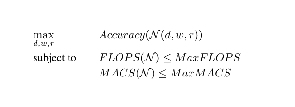

# Running Formulation 1





## Inside the blackbox

### Inputs:

* d: depth factor
* w: width factor
* r: resolution factor

### Outputs:

* Objective function: Validation accuracy of the network
* Constraint value:  (MACS of ResNet18) - (MACS of the current network)
* Constraint value:  (FLOPS of ResNet18) - (FLOPS of the current network)


### Testing one blackbox evaluation

To test one signe blackbox evaluation, we first need to choose values for d, w, and r. Knowing that the triplet (1, 1, 1) 
is equivalent to running ResNet18() with the default image resolution of the database.

A blackbox call can be run with the following command:

```
$ python blackbox.py d w r
```

## Defining the HPO 

The file parameter_file.txt allows to define the Hyperparameter Optimization problem: 

```
DIMENSION               3                               # NOMAD optimizes 3 hyperparameters
BB_EXE                  "$python ./nomad_linker.py"     # The script that links NOMAD to this blackbox

BB_OUTPUT_TYPE          OBJ   EB  EB                    # The blackbox returns 3 outputs: The objective function and the constraints on 
                                                        the FLOPS and MACS
                                                        
BB_INPUT_TYPE           ( R  R  R )                     # d, w and r and Real hyperparameters

X0                      (  1  1  1)                     # NOMAD needs an initial starting point       

LOWER_BOUND             ( 0.5 0.5 0.5 )                 # Lower bound on d, w and r
UPPER_BOUND             ( 2.5  2.5  2.5 )               # Upper bound on d, w and r

MAX_BB_EVAL             200                             # Number of blackbox evaluations
DISPLAY_DEGREE          3                               # Display all the logs of NOMAD
```


## Running an optimization

To run the NOMAD optimization, we need to execute: 

```
$ nomad parameter_file.txt
```


